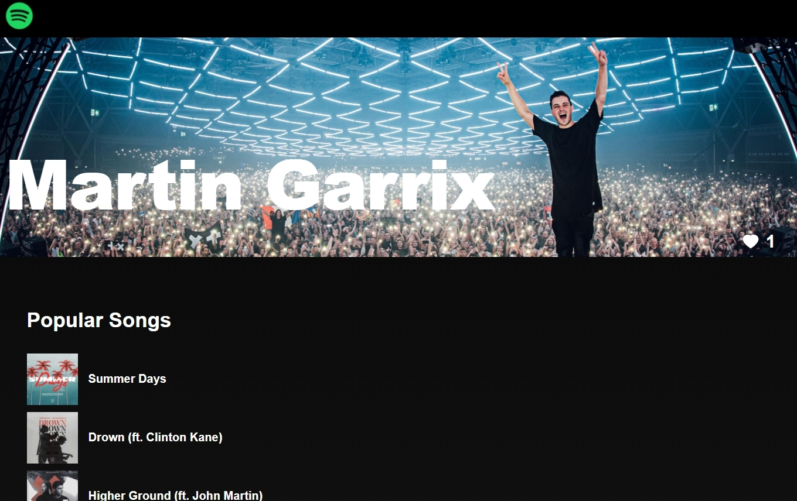
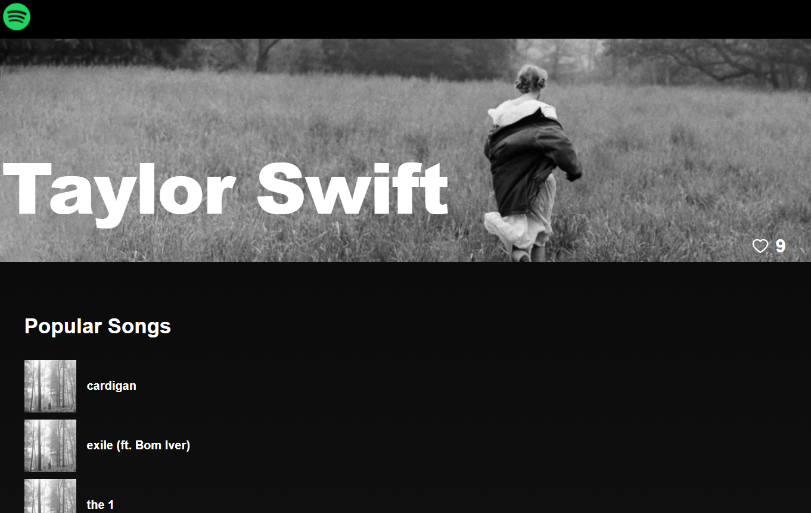

# Spotify

Shows artists and their top songs from Spotify. Data is stored on MongoDB. Developed with React, Redux, Express, Typescript, Mongoose, Jest, React-Testing-Library, JS, HTML, CSS.
Deployed front-end and back-end seperatley.

# Why I Built It And What I've Learned:

-   To understand how to build and deploy a full-stack application.
-   Pros and cons of NoSQL vs SQL.
-   How to use Mongoose to model MongoDB data so that the back-end and the front-end can be integrated together.
-   How to use Typescript with Express and Mongoose.
-   Difference between CORS and proxy.
-   Hiding sensitive keys/information that's used in development from production code.
-   Environmental variables that are used in development and production.
-   Different ways of deploying front-end and back-end.

## NoSQL vs SQL:

### NoSQL:

-   Non-relational database. Useful when data isn't heavily interconnected with other data.
-   Database model is simple to create and understand.
-   Schema can be dynamic, thus the data inserted can be different from each other. Schema is flexible.
-   Scaling is easier with "Horizontal Scaling", where we can add more servers to increase storage.

### SQL:

-   Relational database. Useful when data is heavily interconnected with other data.
-   Database model is challenging to create due to its complex nature (eg; primary and foreign keys).
-   Schema is rigid. Every data inserted must be similar.
-   Scaling is usually done with "Vertical Scaling", where we can improve the server capacity by upgrading or adding resources (eg; CPU/RAM/etc) to the server. This poses a problem when the data grows larger because the server cannot be upgraded infinitely.

## Development vs Production:

-   Have 2 databases. 1 database for developement purposes and 1 for production.
-   Sensitive information such as a database or API key should not be committed to the repo. Store the info locally with a .env file and .gitignore the file. Store the info online by creating an environmental variable in your hosting site.
-   A proxy is used when you don't want other sources/networks accessing the API except yourself.
-   We can deploy the front-end and back-end together with a proxy. Ensure that Express serve the Javascript files after building the React application via `npm run build`.
-   We can deploy the front-end and back-end separately. In this project, our hosting site (Vercel) needs CORS (Cross-origin resource sharing) enabled for the API to be accessed. Thus, other sources could use the API; which isn't ideal for the API's security/privacy.

## React-Testing-Library:

-   Nock is used to intercept HTTP requests made from the API. It does not intercept calls made by the proxy. Must get rid of "proxy" in package.json and restart the app/terminal for tests to work.

## External resources:

-   Postman to test API requests.
-   Prettier to format code and EsLint for linting.
-   Redux dev tool google chrome extension to check the values of the states.

## What It Looks Like






# Getting Started

These instructions will get you a copy of the project up and running on your local machine for development and testing purposes.

1. Clone the project. Use `npm install` to install all the dependencies. Run the project with `npm start` for development or `npm run build` for production.

2. OPTIONAL: If you want to make changes locally, on the terminal, go to the `backend` directory. Type `npm run convert` to start the local server. The command would also listen to changes and convert the Express Typescript files to Express Javascript files that will be used for produciton.

# Prerequisites

What things you need to install the software

```
- Any package manager (npm, yarn)
```

# Versioning

None
